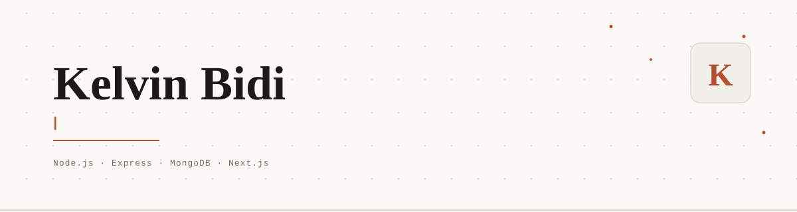
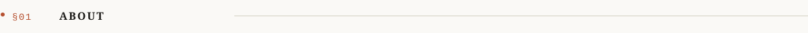
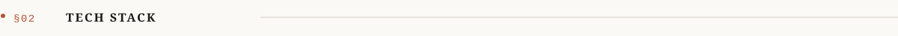
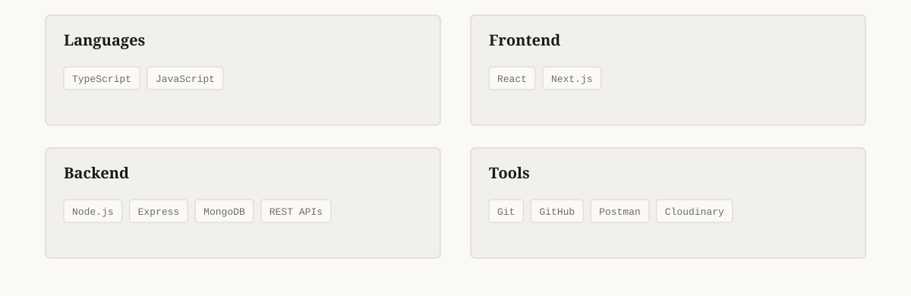
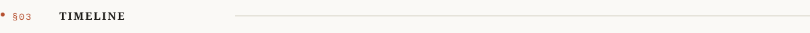
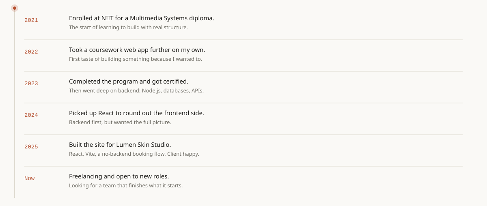
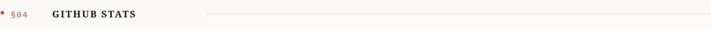
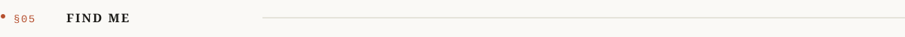
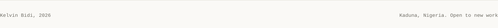

  

 

 

I'm Kelvin Bidi, a full stack developer from Kaduna, Nigeria. My interest in building things didn't start with computer science. It started with games, and with taking apart whatever hardware I could get my hands on to see how it actually worked.

Backend first, then React to round out the frontend side. I work best with people who are driven and disciplined about finishing what they start, and I'd rather ship something real than wait on a process that isn't moving.

Currently freelancing and open to new roles.

 

 

 

 

The full story lives on [my portfolio](#) along with actual projects.

 

 

  
  

 

 

  
  
  

 

