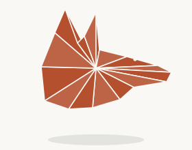

  

 

  
  
  
  

 

 

<table>
<tr>
<td valign="top" width="65%">

I'm Kelvin Bidi, a full stack developer from Kaduna, Nigeria. My interest in building things didn't start with computer science. It started with games, and with taking apart whatever hardware I could get my hands on to see how it actually worked.

Backend first, then React to round out the frontend side. I work best with people who are driven and disciplined about finishing what they start, and I'd rather ship something real than wait on a process that isn't moving.

</td>
<td align="center" width="35%">

</td>
</tr>
</table>

 

 

 

 

 

## Featured Projects

**[Lumen Skin Studio](https://lumen-studioone.vercel.app/)**: booking site for a physician-led aesthetics clinic in Lagos. Lets clients browse services and request a consultation directly, no phone call needed.
`React` `Vite` `TypeScript` `Tailwind CSS` `Framer Motion`

**[Baobab Homes](https://baobab-homes.vercel.app/)**: real estate marketplace for Lagos and Abuja. Connects buyers and renters directly with licensed local agents instead of chasing listings through informal channels.
`Next.js`

**[RemitX](https://remitxx.vercel.app/)**: cross-border remittance app built on the Stellar Network. Near-instant settlement across USD, NGN, GBP, and PHP corridors, without traditional banking fees or delays.
`Next.js` `Stellar SDK`

 

 

  
  

  

 
